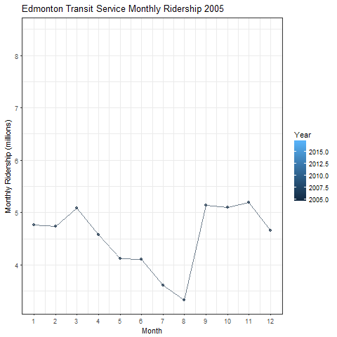
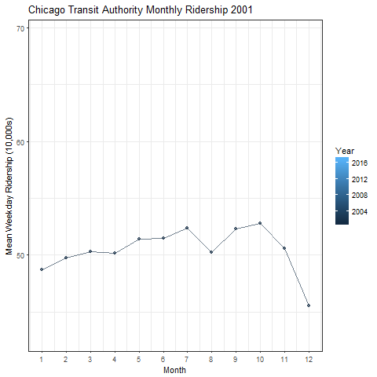

```{r setup, include=FALSE}
knitr::opts_chunk$set(echo = TRUE, warning = FALSE, comments = NA, message = FALSE)
```


# Transit Ridership

## Set up
```{r, results = 'hide'}
library(tidyverse)
library(jsonlite)
library(lubridate)
library(ggplot2)
library(gganimate)
theme_set(theme_bw())
```


## Ridership by Region {.tabset}


### Edmonton

From https://dashboard.edmonton.ca/Dashboard/Transit-Ridership/q4c4-5fu4 (updated January 9, 2018)

This file contains the annual total transit system ridership based on the last 12 months of fare revenue.
```{r}
edmonton <- read_csv('Data/edmonton_ridership.csv')
```

```{r}
head(edmonton)
```

`DateTime` is being read as a factor, which will have to be converted to dates

`Change_.` is also being read as a factor, but I'm not immediately interested in that variable.

```{r}
# In addition to converting `DateTime` into a date object, I'm also going to 
# pull the month from that date object into a new column.

edmonton <- edmonton %>%
    mutate(DateTime = mdy_hms(as.character(DateTime)), 
           Month = month(DateTime)) %>%
    rename(Year = YEAR)
    

```


***

#### Exploratory Plots

<!-- Ridership over the years -->

```{r, eval = FALSE, include = FALSE}
# Hide this chunk as well
edmonton_by_year <- edmonton %>% group_by(Year) %>%
    summarize(mean = mean(MONTH_RIDERSHIP), sd = sd(MONTH_RIDERSHIP))

edmonton_by_year
```


```{r, include = FALSE, eval = FALSE}
# Hide this chunk
ggplot(edmonton_by_year) + 
    aes(x = Year, y = mean) + 
    geom_col(fill = 'orange', alpha = 0.5) +
    geom_point() +
    geom_line(alpha = 0.6, size = 1) +
    geom_errorbar(aes(ymin = mean - sd,
                      ymax = mean + sd),
                  width = 0.2, alpha = 0.3) +
    ylab('Mean Monthly Ridership') +
    scale_x_continuous(breaks = seq(2005, 2017))
```


A simple ridership vs. time scatterplot

```{r}
ggplot(edmonton) +
    aes(x = DateTime, y = MONTH_RIDERSHIP) +
    geom_line() +
    ylab('Monthly Ridership')
```

This is an interesting plot that suggests a very strong seasonality.

***


Split the plot by month
```{r}
summer_months <- as.factor(
    ifelse(!(edmonton$Month %in% seq(5,8)), 'Other', month.abb[edmonton$Month]))
palette <- c('red', 'blue', 'green', 'purple', 'grey')

# All months
p1 <- ggplot(edmonton) +
    aes(x = DateTime, y = MONTH_RIDERSHIP, col = month.abb[Month]) +
    geom_point(alpha = 0.6) +
    geom_line(aes(group = month.abb[Month]), alpha = 0.6) +
    ylab('Monthly Ridership')

# Highlight summer months
p2 <- ggplot(edmonton) +
    aes(x = DateTime, y = MONTH_RIDERSHIP) +
    geom_line(aes(group = Month, col = summer_months), alpha = 0.6) +
    scale_colour_manual('Months', values = palette) +
    geom_point(aes(col = summer_months), alpha = 0.6) +
    ylab('Monthly Ridership')
```

```{r fig.height=3, fig.width=8}
gridExtra::grid.arrange(p1, p2, ncol = 2)
```


***

Here is another way to look at this:
```{r}
p1 <- ggplot(edmonton) +
    geom_line(aes(x = Month, y = MONTH_RIDERSHIP / 1000000, group = Year, col = Year,
                  cumulative = TRUE, frame = Year),
              alpha = 0.6) +
    geom_point(aes(x = Month, y = MONTH_RIDERSHIP / 1000000, group = Year, col = Year,
                   cumulative = TRUE, frame = Year), 
               alpha = 0.6) +
    scale_x_continuous(breaks = seq(1, 12)) +
    ylab('Monthly Ridership (millions)') +
    ggtitle('Edmonton Transit Service Monthly Ridership')

plot_animation <- gganimate(p1, interval = 1, 'edmonton_by_year.gif')
```




We can see that the summer months have much lower transit usage that the oher months. This shoots way back up in September. Blame the university students?

***

How big is this difference?
```{r}
temp <- edmonton %>% 
    group_by(summer = ifelse(Month %in% seq(5,8), 'summer', 'other')) %>%
    summarize(mean = mean(MONTH_RIDERSHIP))

print(temp)
```


```{r}
temp$mean[1] - temp$mean[2]
```

On average, summer months have 1,961,847 fewer rides monthly than other times of the year.

<a href="#top">Back to top</a>


### Chicago

From: https://catalog.data.gov/dataset/cta-ridership-l-station-entries-monthly-day-type-averages-totals-26ba4

These are data for the Chicago 'L' station riderships. This dataset lists monthly station entry averages, by day type (Weekday, Saturday or Sunday/Holiday), as well as monthly totals, beginning in 2001. Note that some stations (such as on the Cermak Branch--now Pink Line) and Skokie did not have Saturday and/or Sunday/holiday service until more recent years, although, in cases where weekday service ran past midnight, late evening fares may appear as part of Saturday tallies.

Unlike the other transit systems, this data set only includes data from train stations (and not buses)


#### Data Manipulation

```{r}
chicago <- read_csv('Data/chicago_ridership.csv')
```

```{r}
head(chicago)
```

Transform the dates to a usable format
```{r}
chicago <- chicago %>% 
    separate(month_beginning, into = c('Month', 'Day', 'Year'),
             sep = '/', remove = F, convert = T)

head(chicago)
```


I noticed in some initial plots is that a handful of Stations had an average of 0 daily riders for that month. An example is below (note I've only included 10,000 rows in the plot below).

```{r}

# Only show 10,000 rows to prevent overplotting
ggplot(chicago[1:10000, ]) +
    aes(x = month_beginning, y = avg_weekday_rides) +
    geom_point(alpha = 0.1)
```

```{r}
# How many cases are there of 0 monthly weekday rides?
length(chicago[chicago$avg_weekday_rides == 0, ]$avg_weekday_rides)
# length(chicago[chicago$avg_saturday_rides == 0, ]$avg_saturday_rides)
# length(chicago[chicago$`avg_sunday-holiday_rides` == 0, ]$`avg_sunday-holiday_rides` )
```


I'm going to assume that 0 daily riders in a month means that the station was closed or the data were missing, so I'm going to change these values to NA so that they better reflect a typical day
```{r}
chicago[chicago$avg_weekday_rides == 0, ]$avg_weekday_rides <- NA
# chicago[chicago$avg_saturday_rides == 0, ]$avg_saturday_rides <- NA
# chicago[chicago$`avg_sunday-holiday_rides` == 0, ]$`avg_sunday-holiday_rides` <- NA
```


Unlike the other data sets, these data are supplied for every single station. To make it more similar, we'll have to combine data from all stations for each month.

```{r}
chicago_by_month <- chicago %>% group_by(Year, Month) %>%
    summarize(avg_weekday_rides = sum(avg_weekday_rides, na.rm = T),
              avg_saturday_rides = sum(avg_saturday_rides, na.rm = T),
              avg_sunday_holiday_rides = sum(`avg_sunday-holiday_rides`, na.rm = T)) %>%
    mutate(DateTime = Year + Month/12)

head(chicago_by_month)
```


#### Plots (Monthly ridership)

```{r}
ggplot(chicago_by_month) +
    geom_line(aes(x = DateTime, y = avg_weekday_rides)) +
    ylab('Monthly Weekday Ridership')
```

Chicago's transit looks to be getting busier over time.


***


Once again, we'll look at the monthly trends

```{r}
p1 <- ggplot(chicago_by_month) +
    geom_line(aes(x = Month, y = avg_weekday_rides / 10000, group = Year, col = Year,
                  cumulative = TRUE, frame = Year),
              alpha = 0.6) +
    geom_point(aes(x = Month, y = avg_weekday_rides / 10000, group = Year, col = Year,
                  cumulative = TRUE, frame = Year),
              alpha = 0.6) +
    scale_x_continuous(breaks = seq(1, 12)) +
    ylab('Mean Weekday Ridership (10,000s)') +
    ggtitle('Chicago Transit Authority Monthly Ridership')


plot_animation <- gganimate(p1, interval = 1, 'chicago_by_year.gif')

```




Chicago also has some seasonality, but unlike Edmonton, it looks to be less busy in the winter.


***

#### Plots (Daily Ridership)

Since we have the luxury of data from every station for every day, let's look at the popularity of each station:
```{r}
chicago_by_station <- chicago %>% group_by(stationame) %>%
    summarize(avg_weekday_rides = mean(avg_weekday_rides),
              avg_saturday_rides = mean(avg_saturday_rides),
              avg_sunday_holiday_rides = mean(`avg_sunday-holiday_rides`))
```


Busiest stations during the week):
```{r}
# Ten busiest stations
chicago_by_station <- chicago_by_station %>% arrange(desc(avg_weekday_rides))

head(chicago_by_station, 10)
```

Plot the 25 busiest stations
```{r, fig.height=5, fig.width=9}
busiest_stations <- chicago_by_station[1:25, ]$stationame

temp <- filter(chicago, stationame %in% busiest_stations)
temp$stationame <- factor(temp$stationame,
    levels = busiest_stations, ordered = TRUE)

ggplot(temp) +
    aes(x = stationame, y = avg_weekday_rides) +
    geom_violin(alpha = 0.5, width = 1.75, fill = 'orange') +
    geom_boxplot(alpha = .5, width = 0.15, fill = 'grey') +
    theme(axis.text.x = element_text(angle = 45, hjust = 1)) +
    ylab('Mean Weekday Rides') + xlab('')
```

***

Busiest stations on saturdays:
```{r}
# Ten busiest stations
chicago_by_station <- chicago_by_station %>% arrange(desc(avg_saturday_rides))

head(chicago_by_station, 10)
```

```{r, fig.height=5, fig.width=9}
busiest_saturday_stations <- chicago_by_station[1:25, ]$stationame

temp <- filter(chicago, stationame %in% busiest_saturday_stations)
temp$stationame <- factor(temp$stationame,
    levels = busiest_saturday_stations, ordered = TRUE)

ggplot(temp) +
    aes(x = stationame, y = avg_saturday_rides) +
    geom_violin(alpha = 0.5, width = 1.5, fill = 'orange') +
    geom_boxplot(alpha = .5, width = 0.15, fill = 'grey') +
    theme(axis.text.x = element_text(angle = 45, hjust = 1)) +
    ylab('Mean Saturday Rides') + xlab('')
```


<a href="#top">Back to top</a>

### Maryland

From: https://catalog.data.gov/dataset/mta-average-weekday-ridership-by-month

These are data for the entire state, rather than for a single city.

The data are given as the average weekday ridership across each medium of transit:

* Intra-city transit: bus, metro, light rail

* Accessibility services: MobilityLink and Taxi Access

* MARC commuter train system, which connects the Baltimore-Washington DC area. 

* Commuter Bus system, which serves to connect suburban areas to urban Baltimore/Washington DC.


Also note that these data are <i>daily</i> ridership numbers, whereas Edmonton's data were supplied as Monthly numbers. We can easily calculate that by multiplying by days in the month, but I won't be doing anything that requires that.

***

#### Data Manipulation

```{r}
json_maryland <- fromJSON('Data/maryland_ridership.json', flatten = TRUE)

maryland <- data.frame(json_maryland$data)
names(maryland) <- json_maryland$meta$view$columns$fieldName
```

```{r}
names(maryland)
```

`total_average_weekday_ridership` is the total average ridership across all transit media, calculated by the folks at the MTA. In general, we'll prefer to use our own calculations rather than ones provided to us. 


```{r}
maryland[1:3, 9:23]    # Display first 3 rows/The first 8 columns are meta data
```

Some problems with the data:

* Everything has been read in as a string/factor

* The MARC and Commuter Bus data are missing (at least for these rows)

***

Fix the variable typing:
```{r}
# Convert columns to correct type
# Also add usable date columns
maryland[] <- lapply(maryland[], function(x) type.convert(as.character(x)))

maryland <- maryland %>% 
    separate(average_weekday_ridership, into = c('Month', 'Year'), sep = '-') %>%
    mutate(Month = match(Month, month.abb), 
           Year = as.numeric(paste('20', Year, sep = '')),
           DateTime = Year + Month / 12)
```


Missingness Plot

```{r,fig.height=4}
# Plot each NA as a bar, sorted by date.

# Sort by date
maryland <- maryland %>% arrange(DateTime)

# Find if entry is missing
x <- as.matrix(is.na(maryland))

# Name columns to match year. To prevent congestion of the axis, only name rows
# that correspond to January (i.e. Month == 1)
dimnames(x)[[1]] <- ifelse(maryland$Month == 1, maryland$Year, NA)

# Reshape matrix x into a single column of data
x <- reshape2::melt(x)

ggplot(x, aes(x = Var2, y = Var1, fill = value)) + 
    geom_tile() +
    scale_fill_brewer('Missing') +
    ylab('Year') + xlab('') +
    theme(axis.text.x = element_text(angle=45, hjust = 1))
```

We see that we don't have data on the MARC until ~2007, and we don't have data on the Commuter Bus or Intracounty Commuter Bus (ICC) until 2011. These will bias the `total_average_weekday_ridership` variable, so we should probably calculate totals ourselves when making comparisons across years.

We can also see that our data do not extend to the end of 2017.
```{r}
max(maryland$DateTime, na.rm = T)
```
They only extend until June.

***

Compare total ridership including MARC, commuter bus, and ICC to intracity ridership
```{r}

# New calculation of total ridership without MARC, Commuter bus, and ICC

maryland <- maryland %>% 
    mutate(ridership_intracity = bus + metro + light_rail + mobility + taxi_access)

maryland_by_year <- maryland %>% group_by(Year) %>% 
    summarize(mean = mean(total_average_weekday_ridership),
              sd = sd(total_average_weekday_ridership),
              mean_intracity = mean(ridership_intracity),
              sd_intracity = sd(ridership_intracity))
```

```{r}
# Compare all trips
p1 <- ggplot(maryland_by_year) + 
    aes(x = Year, y = mean) + 
    geom_col(fill = 'orange', alpha = 0.5) +
    geom_point() +
    geom_line(alpha = 0.6, size = 1) +
    geom_errorbar(aes(ymin = mean - sd,
                      ymax = mean + sd),
                  width = 0.2, alpha = 0.3) +
    ggtitle('All Transit (including MARC, CB, and ICC)') +
    ylab('Mean Monthly Ridership') +
    scale_x_continuous(breaks = seq(2006, 2017)) + 
    ylim(c(0, 450000)) + 
    theme(axis.text.x = element_text(angle = 45, hjust = 1))

p2 <- ggplot(maryland_by_year) + 
    aes(x = Year, y = mean_intracity) + 
    geom_col(fill = 'blue', alpha = 0.5) +
    geom_point() +
    geom_line(alpha = 0.6, size = 1) +
    geom_errorbar(aes(ymin = mean_intracity - sd_intracity,
                      ymax = mean_intracity + sd_intracity),
                  width = 0.2, alpha = 0.3) +
    ggtitle('Intracity Transit Only') +
    scale_x_continuous(breaks = seq(2006, 2017)) +
    ylim(c(0, 450000)) +
    theme(axis.title.y = element_blank(),
          axis.text.x = element_text(angle = 45, hjust = 1))

```

```{r,fig.height=3, fig.width=8}
gridExtra::grid.arrange(p1, p2, ncol = 2)
```

We can see that the 'jumps' in ridership in 2007/2008 and 2011/2012 mostly disappear when we only look at intracity transit.

Also recall that the data for 2017 only go up to June.

***

#### Exploratory Plots

Let's just look at ridership over time for the urban transit system

```{r}
ggplot(maryland) +
    aes(x = DateTime, y = maryland$ridership_intracity) +
    geom_line(alpha = 0.6) +
    ylab('Mean Weekday Ridership')
```


Unlike the Edmonton transit system, the obvious trend is that the transit system is being used less over time. We also don't see any sort of obvious monthly trends.

The dip in February 2010 is interesting. A quick internet search reveals that there was a bad blizzard in February 2010 that covered the roads with 2 feet of snow.


***

Looking at Monthly trends
```{r}
p1 <- ggplot(maryland) +
    geom_line(aes(x = Month, y = ridership_intracity / 10000, group = Year, col = Year,
                  cumulative = TRUE, frame = Year),
              alpha = 0.6) +
    geom_point(aes(x = Month, y = ridership_intracity / 10000, group = Year, col = Year,
                   cumulative = TRUE, frame = Year),
              alpha = 0.6) +
    scale_x_continuous(breaks = seq(1, 12)) +
    ylab('Mean Weekday Ridership (10,000s)') +
    ggtitle('Maryland Transit Administration Monthly Ridership')

plot_animation <- gganimate(p1, interval = 1, 'maryland_by_year.gif')

```


There's a dip in the summer, but you really can't tell what's going on.


<a href="#top">Back to top</a>