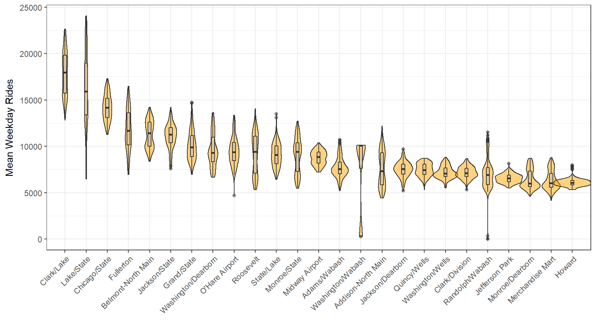
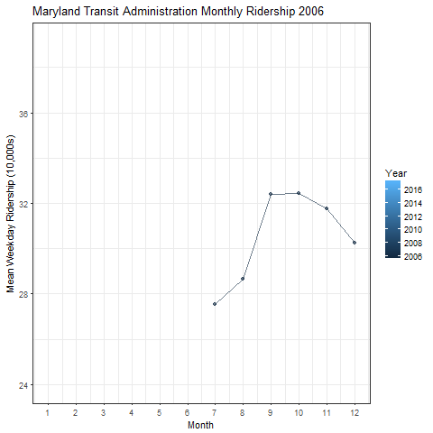

# Transit Ridership

Exploratory data analysis of trends in ridership over time for several transit systems:

* Edmonton Transit System (ETS)

* Chicago Transit Authority (CTA)

* Maryland Transit Administration (MTA)

There is nothing mind blowing in the analysis. It provides an example of a workflow for data exploration through plotting and code examples for fun plots.

## Repository Outline:

* The analyses themselves can be viewed as `Transit_Ridership.html` or `Transit_Ridership.pdf`. The file is meant to be viewed as an html, but I have also produced a pdf that can be rendered on github.

* Original code for the analyses can be found in `Transit_Ridership.Rmd`

***

## Edmonton

This is an interesting plot. There is clear growth in the transit system over time, and also a very strong seasonality. If we split the plot by month, we can see which months in particular are driving this:

We can display this seasonal trend by plotting each year separately

## Chicago

Chicago also looks like it has some seasonal effect.

Interestingly though, it appears to have a different pattern of seasonality as Edmonton. In Chicago, the winter months are the least busy!

The data provided by the CTA include information on each station, so we can look at the busiest light rail stations, and how much traffic they get:

## Maryland

These are data for the entire state, rather than for a single city.

The data are given as the average weekday ridership across each medium of transit:

* Intra-city transit: bus, metro, light rail

* Accessibility services: MobilityLink and Taxi Access

* MARC commuter train system, which connects the Baltimore-Washington DC area. 

* Commuter Bus system, which serves to connect suburban areas to urban Baltimore/Washington DC.

However, if we look at the missingness in the data, we see that don’t have data on the MARC until ~2007, and we don’t have data on the Commuter Bus or Intracounty Commuter Bus (ICC) until 2011.

Unlike the Edmonton transit system, the trend suggests that the transit system is being used less over time (I've only looked at intracity transit, but this happens to be trend even if you include the MARC, commuter bus, and intracounty commuter bus). There look to be differences between months, but you can't make out very easily what the trend is.

The dip in February 2010 is interesting. It turns out there was a bad blizzard in February 2010 that covered the roads with 2 feet of snow.

There’s a dip in the summer, but it's not the cleanest plot!